# Pipeline de dados do Atlas — dos microdados à publicação

Documento de referência de **todo o percurso do dado**: leitura dos microdados do Censo,
extração, classificação, agregação, controle estatístico de revelação, produção da malha
cartográfica, série comparativa entre censos, sincronização com o front-end e publicação do
site.

Complementa, sem substituir:

- `docs/METODOLOGIA.md` — *por que* cada variável é operacionalizada como é (definição de
  migrante, estimador de variância, comparabilidade entre edições, projeção cartográfica).
- `docs/EDICOES.md` — convenções multi-edição e checklist para incluir um censo novo.
- `docs/CHECKLIST_PUBLICACAO.md` — o procedimento humano/jurídico de publicação.
- `CLAUDE.md` — as regras de sigilo, que este pipeline implementa.

Este documento descreve *como o dado se move* e *quais travas existem em cada passagem*.

---

## 1. Visão geral em uma figura

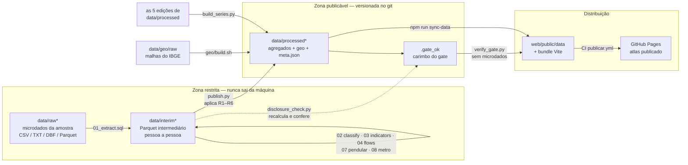

**A regra que organiza tudo**: existe uma única passagem de `data/interim` para
`data/processed` — o par `publish.py` (que aplica as regras) + `disclosure_check.py` (que as
verifica de forma independente, sem confiar em `publish.py`). Nada atravessa essa fronteira
por outro caminho, e nada é copiado para o site sem o carimbo `.gate_ok`.

---

## 2. As três zonas de dado e o que pode sair de cada uma

| Zona | Conteúdo | Granularidade | Versionado? | Pode sair da máquina? |
|---|---|---|---|---|
| `data/raw`, `data/raw2010`, `data/raw2000`, `data/raw1991`, `data/raw1980` | microdados da amostra | pessoa / domicílio | não (`.gitignore` + hook) | **nunca** |
| `data/interim*` | Parquet de trabalho (`pessoas.parquet`, `pessoas_classificado.parquet`, `*_bruto.parquet`) | pessoa / célula sem supressão | não | **nunca** |
| `data/processed*` | agregados aprovados, TopoJSON, `meta.json`, `.gate_ok` | célula publicável | **sim** | sim, depois do gate |

Consequências práticas, todas com trava automática:

- `.gitignore` bloqueia `data/raw*`, `data/interim`, `data/geo/raw`, qualquer `*.csv` e
  `docs/termos/*`.
- O hook `scripts/pre-commit` roda `pipeline/verify_gate.py` sempre que houver arquivo de
  `data/processed` no *stage*, e recusa o commit se o carimbo não bater.
- O CI (`.github/workflows/publicar.yml`) varre **todo o histórico do git** atrás de arquivos
  em `data/raw*`/`data/interim` ou de qualquer `*.csv` — só `pipeline/rm_nucleo.csv` e
  `pipeline/genealogia_municipios.csv` são exceção declarada.
- Nenhum script do pipeline imprime registro individual: só esquemas, contagens, somas de peso
  e distribuições agregadas.

---

## 3. O pipeline SQL, etapa por etapa

`pipeline/run.py` é o orquestrador: abre uma conexão DuckDB em memória e executa
`pipeline/sql/NN_*.sql` em ordem de prefixo.

```bash
python pipeline/run.py              # todas as etapas, edição 2022
python pipeline/run.py 03           # só 03_indicators.sql
python pipeline/run.py --edicao 2010
```

### 3.1 Grafo de arquivos

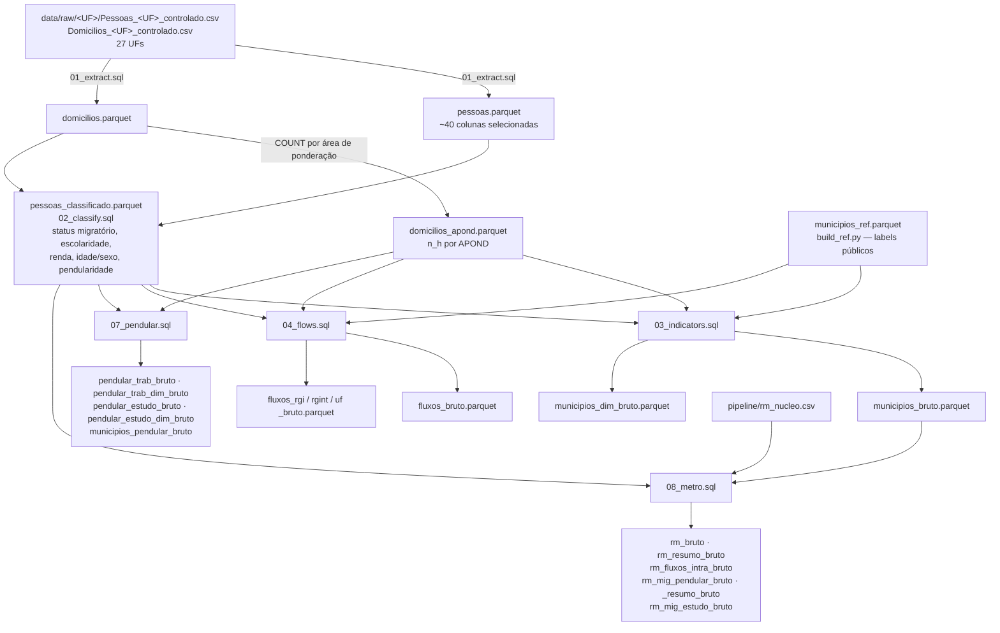

Tudo o que sai dessas etapas mora em `data/interim` e traz o sufixo `_bruto`: são células
**sem supressão**, com contagem amostral exata. É matéria-prima do gate, nunca produto final.

### 3.2 `01_extract.sql` — extração

Lê os 27 CSV de pessoas e os 27 de domicílios com `read_csv(..., all_varchar = true,
union_by_name = true)` e grava dois Parquet, selecionando só as colunas usadas adiante
(identificação territorial, peso, sexo/idade, naturalidade, data fixa, escolaridade, trabalho e
deslocamento, renda, e os indicadores de imputação `MP*`).

Decisões que se repetem em todo o pipeline e nascem aqui:

- **Todo código territorial é `VARCHAR` com zero-padding** (7 dígitos para município, 2 para
  UF). `INTEGER` perderia o zero à esquerda de Rondônia a Alagoas.
- **`TRY_CAST` em tudo que é numérico**, para que um campo em branco vire `NULL` em vez de
  derrubar a extração.
- O terceiro `COPY` produz `domicilios_apond.parquet`: `n_h`, o número de domicílios
  amostrados em cada área de ponderação. É o denominador do estimador de variância.

### 3.3 `02_classify.sql` — classificação

Junta pessoas e domicílios por `controle` e produz `pessoas_classificado.parquet` com **toda a
população**, não só os migrantes — o atlas compara o perfil do migrante ao do residente, então
o grupo de comparação precisa estar no mesmo arquivo.

Famílias de variáveis derivadas:

| Grupo | Campos criados |
|---|---|
| Migração | `is_migrante`, `is_mig_interno`, `is_mig_internacional`, `origem_conhecida`, `origem_valida`, `interestadual`, `status`, `retorno_uf_natal` |
| Perfil | `edu_grupo` (25 anos ou mais), `renda_classe`, `idade_grupo`, `sexo_label`, `idade_sexo_grupo` |
| Trabalho/estudo | `ocupado`, `estudante`, `pendular_trab`, `pendular_estudo`, `pos_grupo`, `setor_grupo`, `ocup_grupo`, `modo_grupo`, `renda_trab_classe`, `curso_grupo` |

Dois detalhes que valem por si:

- **`origem_valida` é o universo canônico de migração.** É `df_local = '2'` (morava em outro
  município do Brasil) **e** origem conhecida **e** origem ≠ destino. Só ele alimenta
  imigração, emigração e fluxos — é o que garante a identidade Σ imigrantes = Σ emigrantes.
- **O `COALESCE` em volta de cada predicado não é cosmético.** `df_local` é `NULL` para quem
  mora há 6 anos ou mais no município; sem `COALESCE`, `NOT is_migrante` viraria `NULL` e
  apagaria ~19 milhões de não migrantes dos grupos de comparação.

### 3.4 `03_indicators.sql` — indicadores municipais e erro amostral

Produz duas tabelas: `municipios_bruto.parquet` (uma linha por município, com população,
imigração, emigração, saldo, taxas e erros-padrão) e `municipios_dim_bruto.parquet` (perfil em
formato longo: `cd_mun × direção × dimensão × categoria`).

O estimador de variância é o de **conglomerados últimos**, com o domicílio como unidade
primária e a área de ponderação como estrato — o IBGE não divulga estratos e UPAs reais nos
microdados da amostra:

$$\operatorname{Var}(Y)=\sum_h \frac{n_h}{n_h-1}\sum_{i\in h}\left(z_{hi}-\bar z_h\right)^2,
\qquad z_{hi}=\sum_{k\in i} w_k\,y_k$$

Como só domicílios **com** migrante têm $z \neq 0$, a soma sobre todos os $n_h$ domicílios do
estrato se reduz à forma fechada implementada no SQL:

$$\frac{n_h}{n_h-1}\left(S_{2h}-\frac{S_{1h}^{2}}{n_h}\right),\qquad
S_{1h}=\sum z_{hi},\quad S_{2h}=\sum z_{hi}^{2}$$

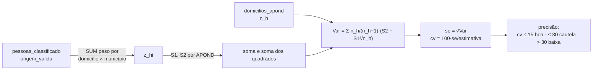

A mesma forma fechada reaparece, recalculada do zero, em cada nível de agregação: por par
origem→destino (`04_flows.sql`), por par RGI/RGInt/UF, por fluxo pendular (`07`) e por fluxo
intra-RM (`08`). Variância **nunca** é somada entre níveis.

As classes de precisão seguem o Guia do IBGE (2021): CV ≤ 15% boa, ≤ 30% cautela, acima disso
baixa; `sem_estimativa` quando a edição não tem chave de domicílio (Censo 1980).

### 3.5 `04_flows.sql` — matriz origem→destino

Reduz `pessoas_classificado` ao universo `origem_valida` e produz a matriz municipal com
caracterização já embutida em colunas (`st_*`, `edu_*`, `ren_*`, `is_*`, `interestadual`), mais
as matrizes agregadas por RGI, RGInt e UF — cada uma **dissolvendo os fluxos internos**
(`WHERE o_rgi <> d_rgi`), porque uma migração entre dois municípios da mesma região imediata
não é um fluxo *entre* regiões imediatas.

### 3.6 `07_pendular.sql` — deslocamento pendular

Dois universos independentes: trabalho (ocupados de 10 anos ou mais) e estudo (quem frequenta
escola ou creche). Um fluxo pendular exige destino **conhecido** e diferente do município de
residência; "trabalha em mais de um município" e "trabalha no exterior" não têm destino e
entram apenas como categorias dos indicadores municipais, jamais na matriz.

Saídas: a matriz por par, a caracterização longa em 9 dimensões (frequência, modo, tempo,
posição, setor, ocupação, renda do trabalho, escolaridade, idade/sexo) e os indicadores
municipais — incluindo `taxa_saida_pendular` e `indice_atracao`.

### 3.7 `08_metro.sql` — módulo metropolitano

Cruza o recorte metropolitano com a tipologia núcleo/periferia de `pipeline/rm_nucleo.csv`
(gerado por `build_rm_nucleo.py`: núcleo é o município membro homônimo da RM; na falta dele, o
mais populoso) e responde à pergunta da desconcentração metropolitana com uma **tripla**:

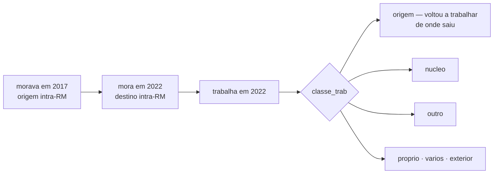

Daí saem `rm_fluxos_intra` (com tipologia núcleo→periferia, periferia→núcleo,
periferia→periferia), o cruzamento migração×pendularidade, o equivalente para estudo e o resumo
por região metropolitana.

---

## 4. O gate de revelação

É o único ponto em que dado atravessa para a zona publicável, e ele é **duplo de propósito**:
quem escreve não é quem aprova.

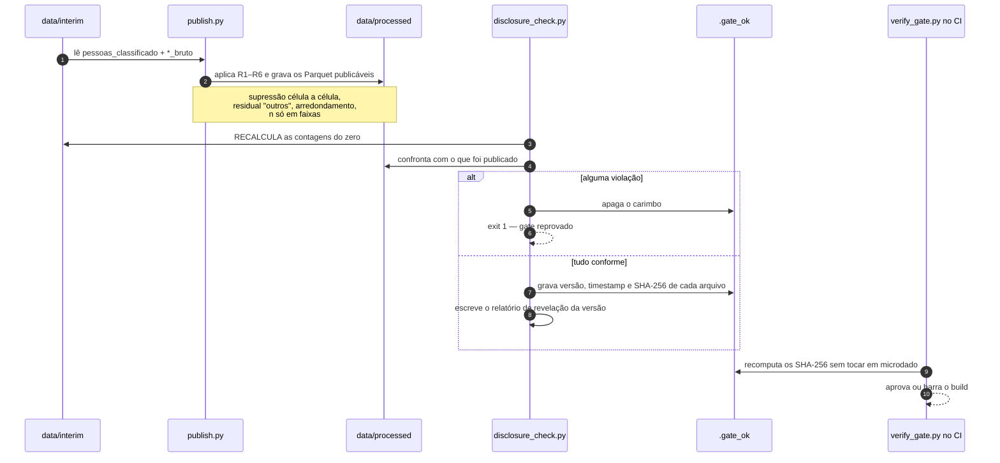

`disclosure_check.py` **não confia** em `publish.py`: ele reabre
`pessoas_classificado.parquet`, recomputa `n` e `ndom` de cada célula publicada e compara.
Também confere a declaração de `chave_domicilio` contra os próprios microdados — declarar
`False` numa edição que tem a chave seria um caminho para publicar abaixo do limiar.

### 4.1 As regras

| Regra | O que faz | Parâmetro padrão |
|---|---|---|
| **R1** | limiar mínimo por célula publicada | `n ≥ 5` **e** `ndom ≥ 3` |
| **R2** | detalhe por características só em fluxo com massa | `n ≥ 20` |
| **R3** | supressão complementar: o suprimido vai para `<dimensao>__outros`, preservando o total | — |
| **R4** | arredondamento das estimativas ponderadas | múltiplos de 5 |
| **R5** | contagem amostral só em faixas, nunca exata | `<5`, `5-19`, `20-49`, `50-99`, `100-499`, `>=500` |
| **R6** | geografia e cruzamentos: município é a menor unidade; nenhuma coluna de domicílio ou área de ponderação; sem cruzamento de 3+ dimensões temáticas | `COLUNAS_PROIBIDAS` |
| **R7–R9** | integridade da publicação: só arquivos esperados, nada de CSV, carimbo íntegro | ver `verify_gate.py` |

`pipeline/disclosure_rules.py` é a **fonte única** desses valores; `publish.py` os aplica e
`disclosure_check.py` os verifica a partir do mesmo módulo, de modo que regra e verificação não
podem divergir.

### 4.2 Edição sem chave de domicílio

O piso `ndom ≥ 3` não protege contra célula pequena — disso já cuida `n ≥ 5`. Ele protege
contra célula sustentada por **poucas unidades correlacionadas**: cinco pessoas podem ser uma
família só que migrou junta. Quando a fonte não publica identificador de domicílio (hoje, só o
Censo 1980), `COUNT(DISTINCT controle)` é 0 para todo grupo e o piso não é computável.

Em vez de deixá-lo cair calado, cada patamar sobe um degrau:

| | Com chave | Sem chave (1980) |
|---|---|---|
| R1 | `n ≥ 5` e `ndom ≥ 3` | `n ≥ 20` |
| R2 | `n ≥ 20` | `n ≥ 50` |
| `se` / `cv` | estimados | `NULL`, precisão `sem_estimativa` |

A calibração está em `docs/METODOLOGIA.md`, seção do Censo 1980, item 8.

### 4.3 O que o gate produz

- `data/processed/.gate_ok` — JSON com versão dos dados, timestamp e o **SHA-256 de cada
  arquivo publicável**, recursivo (inclui `geo/`), excluindo lixo de sistema operacional e
  subpastas que têm gate próprio (uma edição dentro de outra).
- `docs/relatorio_revelacao_<versao>.md` — regras aplicadas, verificações independentes,
  tabela de arquivos com linhas/tamanho/hash e o balanço de supressão.

Exemplo real da edição 2022 (versão 2026-09-17): 326.973 pares origem→destino existem na
amostra; 53.097 passam em R1 (16,2% dos pares), cobrindo **67,6% do volume migratório
estimado**. Os pares suprimidos continuam contabilizados nos totais municipais — nenhum volume
se perde, só a identificação do par.

### 4.4 A verificação que roda sem microdados

`pipeline/verify_gate.py` existe porque o CI e qualquer clone do repositório **não têm**
`data/interim`. Ele confere:

1. o carimbo existe e tem o formato esperado;
2. o SHA-256 de cada arquivo publicável bate — nada mudou, sumiu ou foi acrescentado depois do
   gate;
3. checagens estruturais independentes de microdado: nenhum `*.csv`, nenhuma coluna proibida,
   nenhuma contagem exata (`n`/`n_*` que não termine em `_faixa`), e toda coluna de contagem
   ponderada em múltiplos de 5.

---

## 5. Múltiplas edições do Censo

Cinco edições convivem no mesmo pipeline. `pipeline/edicoes.py` é a fonte única dos caminhos e
das constantes que variam.

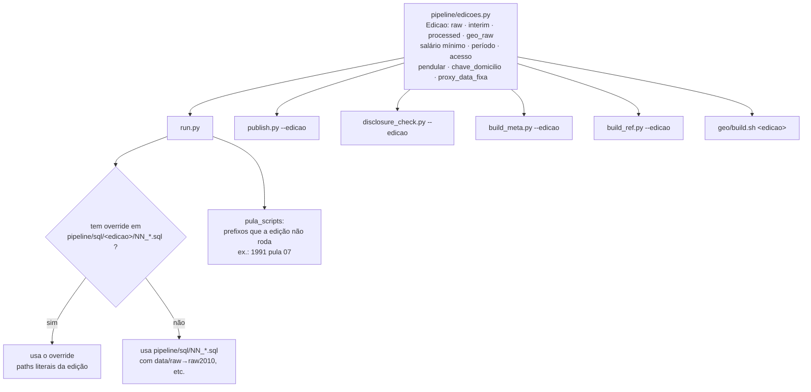

| Edição | Fonte | Formato de entrada | Migração | Pendular | Chave de domicílio | Renda |
|---|---|---|---|---|---|---|
| 2022 | IBGE, acesso controlado | CSV | data fixa 2017→2022 | sim | sim | sim |
| 2010 | IBGE, público | largura fixa | data fixa 2005→2010 | sim, sem modo | sim | sim |
| 2000 | IBGE, público | largura fixa | data fixa 1995→2000 | sim, sem frequência/modo/tempo | sim | sim |
| 1991 | IBGE, público (DBF → TXT por `scripts/prep_1991.py`) | largura fixa | data fixa 1986→1991 | **não** (`pula_scripts=["07"]`) | sim | sim |
| 1980 | **censobr/IPEA v1.0.0**, Parquet público (`scripts/prep_1980_censobr.py`); até `1.0.7-1980`, Base dos Dados/BigQuery (`scripts/extract_1980_bd.py`) | Parquet por UF | **proxy** de data fixa 1975→1980 | sim (estudo só de 10 anos ou mais) | **não** | **não** (a fonte tem; não publicada) |

Particularidades que o pipeline carrega explicitamente:

- **Layout por edição.** `layout_1991.py`, `layout_2000.py`, `layout_2010.py` e os módulos
  `labels_*` são **gerados** a partir da documentação pública do IBGE (`gen_edicao_*.py`,
  `gen_labels.py`) — nunca lidos dos microdados.
- **Vocabulário de `status`.** Só 2022 distingue `primeira_saida` de `etapas_multiplas`; as
  demais edições não coletam o município de nascimento e colapsam as duas em `nao_natural`.
  `disclosure_rules.STATUS_POR_EDICAO` falha alto se uma edição nova não declarar seu
  vocabulário.
- **Recortes territoriais retroativos.** RGI/RGInt/RM são o recorte de 2022 aplicado
  retroativamente por código de município — decisão registrada em `docs/EDICOES.md`.
- **Os 52 municípios do norte de Goiás (1980).** Chegam da fonte com o código de 1980
  (`52xxxxx`; Fernando de Noronha com `2000107`) e são **recodificados para o código de 2022**
  (`17xxxxx`; `2605459`) por `pipeline/norte_goias_1980.py`, fonte única da recodificação:
  `build_ref.py` grava as 52 linhas de `municipios_ref` (UF `'17'`, recortes de 2022) e
  `data/interim/1980/mun6_lookup.parquet` (3.991 prefixos **de 1980** → código publicado), com o
  qual `01_extract.sql` resolve residência, origem e destino pendular; `id_municipio` nulo aborta a
  extração. O gate (R6) confere que nenhum `'NORTEGO'`, `52xxxxx` ou `2000107` foi publicado e que
  os 53 códigos recodificados aparecem uma vez cada, com população, UF e recortes. De `1.0.2` a
  `1.0.7-1980`, com a Base dos Dados como fonte, o território era publicado como **uma** unidade
  agregada, `NORTEGO` (ver `pipeline/sql/1980/MAPEAMENTO_norte_goias.md`).
- **Selo `proxy_data_fixa`.** A migração de 1980 é reconstruída a partir de tempo de residência
  + última etapa; a interface nunca a apresenta como data fixa.

---

## 6. Cartografia

`geo/build.sh` transforma a malha municipal do IBGE em TopoJSON leve, e é **dado público** —
fora do regime de sigilo, mas dentro do regime de verificação.

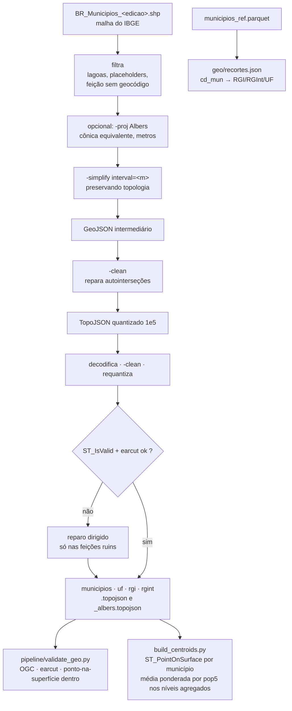

Três decisões que explicam a forma do script:

1. **`-simplify` seguido de `-clean` na mesma invocação do mapshaper desfaz a simplificação** —
   ela é *lazy* e só se materializa na escrita. Por isso cada produto roda em duas invocações.
2. **A quantização pode reintroduzir autointerseção** que o `-clean` já havia corrigido, porque
   arredonda coordenadas para a grade. A validação roda **depois** da quantização, no arquivo
   final, não no intermediário.
3. **Centroide de município é `ST_PointOnSurface`, não `ST_Centroid`** — o centroide geométrico
   de um município em ferradura pode cair fora do próprio polígono; o arco do mapa ficaria
   ancorado no mar.
4. **A tolerância de simplificação é um intervalo em metros, não uma porcentagem de vértices**
   (`interval=1000` municípios, `interval=700` UF/RGI/RGInt). Uma porcentagem fixa deixava as
   malhas antigas, de fonte 30 vezes menos densa, com 6–10 pontos por município e área
   redistribuída entre vizinhos; `validate_geo.py` confere, como terceiro critério, que o
   ponto-na-superfície da malha bruta cai dentro do polígono publicado (limiar 0,5%).

Cada produto sai em duas versões: em graus (SIRGAS 2000) e em metros (Albers cônica
equivalente, parâmetros fixos para as cinco edições). A simplificação roda **depois** da
reprojeção, para que o erro seja ponderado igual no país inteiro.

---

## 7. A série "Ao longo dos censos" (F12)

`pipeline/build_series.py` lê **só `data/processed`** — as cinco edições já aprovadas — e nunca
microdados. É recombinação de agregado público, não um sexto pipeline.

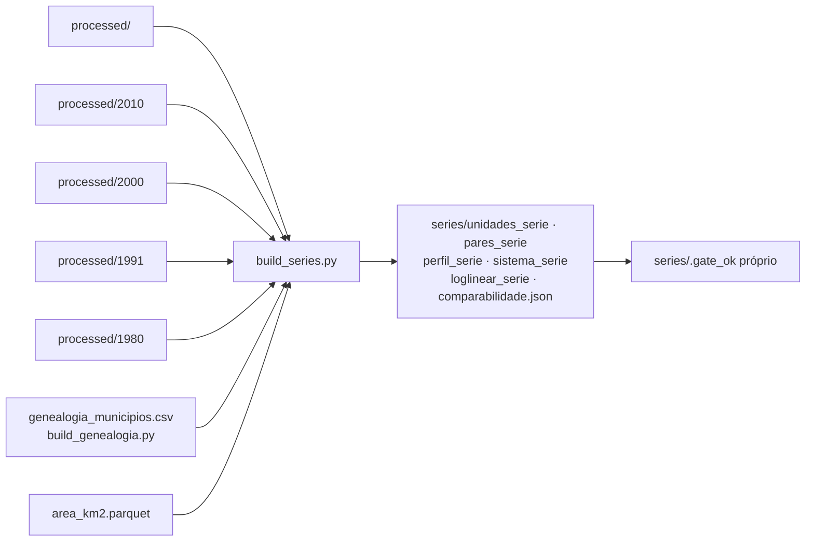

Pontos metodológicos que o código materializa:

- **Sem AMC.** A base territorial é o recorte de 2022 comparado retroativamente; a genealogia
  municipal (`build_genealogia.py`, por sobreposição espacial das malhas) é **metadado de
  comparabilidade**, não unidade de análise. O contrapeso é o limiar de cobertura de 0,90.
- **Erro amostral agregado** é combinado como `√Σ se²` — municípios tratados como
  independentes, aproximação declarada, não recálculo do desenho amostral.
- **`perfil_serie` agregado é soma de células municipais já suprimidas**, então as linhas
  agregadas carregam `comparavel_com_ressalva = True`.
- Medidas de sistema e a decomposição log-linear não são calculadas para `nivel='rm'`: as RMs
  não particionam o país e não existe matriz RM×RM publicada.

---

## 8. Do `data/processed` ao site

### 8.1 Sincronização e runtime do front-end

```bash
npm run copy-duckdb --prefix web   # runtime do DuckDB-WASM -> web/public/duckdb
npm run sync-data --prefix web     # data/processed -> web/public/data (exige .gate_ok)
npm run dev --prefix web           # porta 5174
```

`sync-data.sh` recusa rodar sem `data/processed/.gate_ok`, copia todas as edições e **remove os
carimbos da cópia** — `.gate_ok` nunca vai para o site.

No navegador, não há servidor de dados: as consultas rodam em **DuckDB-WASM**, uma instância
por edição, lendo os Parquet publicados por URL com *range requests* — a matriz de fluxos nunca
é baixada inteira.

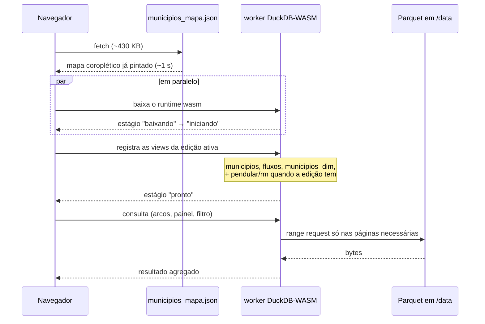

A primeira pintura não espera o motor: `municipios_mapa.json` é um arquivo enxuto, gerado por
`publish.py`, só com o que o coroplético precisa. O DuckDB assume depois, para fluxos, perfis e
filtros. `EstadoDados` mostra em que estágio a carga está.

O estado da seleção (`origem`, `destino`, `metrica`, `nivel`, `filtros`, `censo`, `modo`) é
refletido na URL — toda vista é compartilhável.

### 8.2 Páginas estáticas de SEO

`pipeline/build_paginas.py` roda **depois** do `vite build`, lê exclusivamente
`data/processed` e escreve HTML indexável em `web/dist` — nunca em `web/public`, para não
inflar o repositório. Não recalcula estatística nenhuma: no máximo formata, soma ou deriva o
intervalo de confiança `valor ± 1,96·se` a partir de colunas já publicadas, exatamente como o
app interativo faz.

```bash
SITE_URL=https://<dominio> npm run build:site --prefix web
```

### 8.3 Integração contínua

O CI **não roda o pipeline de dados** — ele não tem os microdados, por construção. Ele verifica,
constrói e publica os agregados já aprovados e versionados.

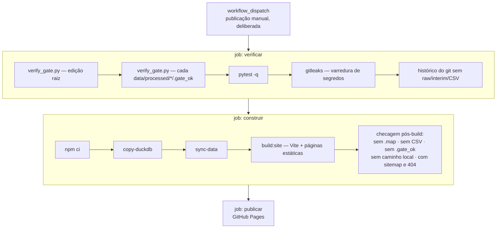

O gatilho automático em `push: main` está **suspenso de propósito**: integrar trabalho na `main`
e colocar o site no ar são atos separados enquanto a decisão de publicar segue em aberto (ver
`legal/` e `docs/CHECKLIST_PUBLICACAO.md`). Publicar é: aba *Actions* → *Publicar* → *Run
workflow*.

---

## 9. Verificação em cada camada

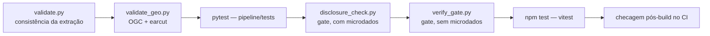

`pipeline/validate.py` confere, entre outras coisas: mais de 20 milhões de registros, soma
nacional de pesos ≈ 203.080.756 (Notas 04/2026, Tabela 3), 27 UFs presentes, soma por UF dentro
de ±30% do valor de referência, proporção de migrantes de data fixa entre 2% e 12%, 100% dos
códigos de município pertencentes à lista de 2022, e 100% das pessoas casando com um domicílio.

Os testes em `pipeline/tests/` cobrem cada fase (`test_f1_extract`, `test_f2_indicators`,
`test_f2b_pendular`, `test_f3_geo`), cada edição (`test_edicao_1980` … `test_edicao_2010`), os
limiares de revelação, o verificador de gate, as medidas da série e o gerador de páginas. Os que
dependem de microdados detectam a ausência de `data/interim` e se autopulam, de modo que a suíte
roda inteira no CI.

---

## 10. Sequência completa de execução

Na máquina com acesso aos microdados, para uma edição:

```bash
source .venv/bin/activate

python pipeline/gen_labels.py data/raw          # 1. rótulos públicos (só quando mudarem)
python pipeline/build_ref.py                    # 2. municipios_ref.parquet
python pipeline/run.py                          # 3. 01 → 08, tudo em data/interim
python pipeline/validate.py                     # 4. consistência
./geo/build.sh                                  # 5. malhas + validação geométrica
python pipeline/build_centroids.py              # 6. centroides por nível
python pipeline/publish.py                      # 7. aplica R1–R6 → data/processed
python pipeline/build_meta.py                   # 8. meta.json
python pipeline/disclosure_check.py --versao <v> # 9. GATE: verifica e carimba
python pipeline/verify_gate.py                  # 10. confere o carimbo de forma independente
pytest -q                                       # 11. suíte
```

Para uma edição antiga, rode antes a **preparação da entrada** — `scripts/prep_1991.py` (1991),
`scripts/prep_2000.sh` (2000) ou `scripts/prep_1980_censobr.py` (1980: Parquet do censobr → 27
partições, com gates de identidade e `docs/qa/censobr_1980.md`) — e acrescente `--edicao <ano>`
aos passos 2, 3, 7, 8, 9 (e o ano como argumento em `geo/build.sh`). Depois que **todas** as edições estiverem publicadas:

```bash
python pipeline/build_genealogia.py             # metadado de comparabilidade
python pipeline/build_series.py                 # série entre censos + gate próprio
```

E então a publicação:

```bash
npm run sync-data --prefix web
git add data/processed docs/relatorio_revelacao_<versao>.md
git commit && git push
```

O commit dispara o hook `pre-commit`, que roda `verify_gate.py` automaticamente. A publicação em
si é o disparo manual do workflow *Publicar*.

---

## 11. Mapa de arquivos

### Orquestração e configuração

| Arquivo | Papel |
|---|---|
| `pipeline/run.py` | executa os SQL em ordem, adapta paths por edição, aplica overrides e `pula_scripts` |
| `pipeline/edicoes.py` | fonte única de caminhos e constantes por edição |
| `pipeline/disclosure_rules.py` | fonte única das regras R1–R6 e dos vocabulários publicáveis |

### SQL

| Arquivo | Produz |
|---|---|
| `sql/01_extract.sql` | `pessoas`, `domicilios`, `domicilios_apond` |
| `sql/02_classify.sql` | `pessoas_classificado` |
| `sql/03_indicators.sql` | `municipios_bruto`, `municipios_dim_bruto` |
| `sql/04_flows.sql` | `fluxos_bruto` e agregados por RGI/RGInt/UF |
| `sql/07_pendular.sql` | fluxos e indicadores de deslocamento pendular |
| `sql/08_metro.sql` | módulo metropolitano e o cruzamento migração×pendularidade |
| `sql/<edicao>/NN_*.sql` | overrides da edição, com `MAPEAMENTO_*.md` ao lado justificando cada decisão de layout |

### Publicação e verificação

| Arquivo | Papel |
|---|---|
| `pipeline/publish.py` | aplica R1–R6 e grava `data/processed` |
| `pipeline/disclosure_check.py` | gate independente, com microdados; grava `.gate_ok` e o relatório |
| `pipeline/verify_gate.py` | confere o carimbo sem microdados (CI, hook, qualquer clone) |
| `pipeline/build_meta.py` | `meta.json`: rótulos, cortes, limiares, DOI, bounds |
| `pipeline/build_paginas.py` | páginas estáticas de SEO em `web/dist` |

### Apoio

| Arquivo | Papel |
|---|---|
| `pipeline/build_ref.py` | tabela de referência territorial a partir dos rótulos públicos |
| `pipeline/build_rm_nucleo.py` | define o núcleo de cada RM/RIDE |
| `pipeline/build_centroids.py` | centroides por nível, em graus e em Albers |
| `pipeline/build_genealogia.py` | genealogia municipal e áreas, por sobreposição espacial |
| `pipeline/build_series.py` | série comparativa entre as cinco edições |
| `pipeline/gen_labels.py`, `gen_edicao_*.py` | geram `labels_*`/`layout_*` da documentação pública |
| `scripts/prep_1991.py`, `scripts/prep_2000.sh`, `scripts/prep_1980_censobr.py` | preparam a entrada de cada edição antiga |
| `scripts/extract_1980_bd.py` | extração da Base dos Dados, fonte de 1980 até `1.0.7-1980`; mantido como registro e como referência dos gates de `prep_1980_censobr.py` |
| `geo/build.sh`, `geo/fetch_*.sh`, `geo/repair_geojson.py` | malhas cartográficas |

---

## 12. Incluir uma edição nova

O caminho curto: `docs/EDICOES.md`, seção "Checklist para incluir uma edição nova". Em resumo,
uma edição nova precisa declarar-se em cinco lugares — `pipeline/edicoes.py` (caminhos e
capacidades), `disclosure_rules.STATUS_POR_EDICAO` (vocabulário, sob pena de `ValueError`),
`pipeline/sql/<edicao>/` (overrides com o mapeamento documentado), `web/src/lib/edicoes.ts`
(recursos que o app precisa esconder) e `docs/METODOLOGIA.md` (seção de comparabilidade) — e
então percorrer a mesma sequência da seção 10, com `--edicao`.
